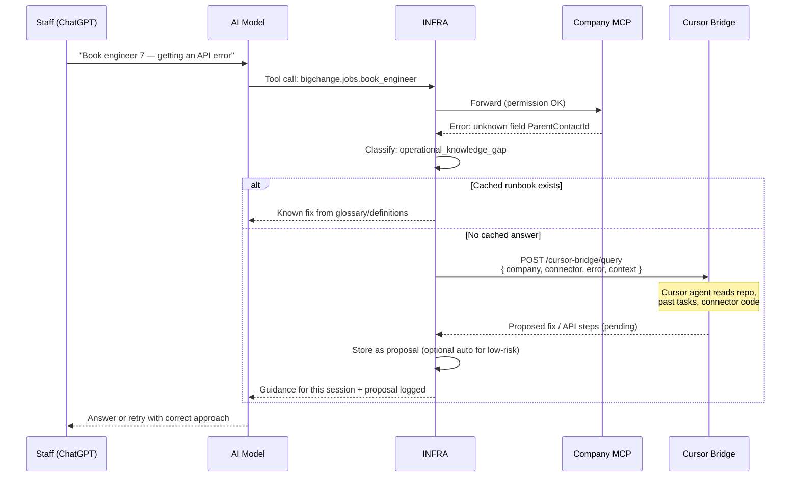

# INFRA ↔ Cursor Knowledge Bridge

When ChatGPT, Claude, or an MCP tool is **unsure how to call an API** or interpret business-system behaviour, INFRA can escalate to **Cursor** as a developer-knowledge layer — then return the answer (or an approved runbook) to the AI client.

This is **not** Cursor in every request path. It is an **escalation channel** for unknown or failed operations.

---

## Why this exists

| Layer | Knows |
| --- | --- |
| **ChatGPT / Claude** | Natural language, general reasoning |
| **Company MCP** | Approved tools, connectors, company definitions |
| **INFRA** | Permissions, metering, definitions, audit |
| **Cursor** | Repo history, connector code, past fixes, developer context (“your brain”) |

Example: BigChange returns an obscure error on `ParentContactId`. MCP doesn't know the fix. ChatGPT asks INFRA. INFRA escalates to Cursor. Cursor responds with the correct field mapping from prior EL work. INFRA stores approved snippet → future requests skip escalation.

---

## Flow



---

## API shape (planned)

### INFRA → Cursor (escalation)

```
POST https://api.infra.example/cursor-bridge/query
Authorization: Bearer <infra-service-token>

{
  "requestId": "req_abc123",
  "companyId": "co_el",
  "connector": "bigchange",
  "queryType": "api_error | how_to | definition_gap",
  "userQuestion": "How do I book engineer 7 when ParentContactId fails?",
  "errorDetail": { "code": "...", "raw": "..." },
  "mcpTool": "bigchange.jobs.book_engineer",
  "context": { "role": "office_staff" }
}
```

### Cursor → INFRA (response)

```
POST https://api.infra.example/cursor-bridge/response
Authorization: Bearer <cursor-bridge-secret>

{
  "requestId": "req_abc123",
  "status": "answered | needs_human | rejected",
  "answer": "Use ContactId not ParentContactId for EL BigChange tenant...",
  "proposedGlossary": { "term": "parent contact", "api_hint": "..." },
  "proposedDefinition": null,
  "shareAcrossCompanies": false,
  "sources": ["infra/packages/connectors/bigchange/README.md"]
}
```

---

## What gets shared across platforms

| Asset | Scope | Approval |
| --- | --- | --- |
| **Company glossary** | One company (EL) | Owner / developer |
| **Company definitions** | One company | Owner / developer |
| **Connector runbooks** | All companies using that connector | Platform Owner |
| **Escalation Q&A cache** | Per company unless `shareAcrossCompanies: true` | Developer |

HT and EL both use BigChange → a **connector runbook** fix can be shared. EL-specific revenue rules stay EL-only.

---

## Security rules

1. **No live credentials** in Cursor bridge payloads — reference `secret_ref` only
2. **No former-company data** (Nirvana, Aquilo, Urban Maintenance) in queries or responses
3. **High-risk write instructions** from Cursor still require normal permission checks before execution
4. **Responses are proposals** until approved (same as company definitions Tier 2)
5. **Audit every escalation** — who asked, what Cursor returned, what was applied

---

## v0.1 vs later

| Phase | Capability |
| --- | --- |
| **v0.1** | Manual: MCP error logged → you fix in Cursor → push definition/runbook to INFRA API |
| **v0.2** | Automated escalation webhook; Cursor agent responds async; approval queue |
| **v0.3** | Cached runbooks; reduced escalations; cross-company connector knowledge library |

---

## Relationship to other INFRA pieces

```
ChatGPT question
    → MCP tool (normal path)
    → INFRA permissions + metering
    → On failure/uncertainty → Cursor bridge (this doc)
    → Approved knowledge → company_definitions / glossary / runbooks
    → Next request uses cached knowledge (no Cursor needed)
```

Cursor is the **authoring and escalation brain**, not the runtime meter or permission engine.
