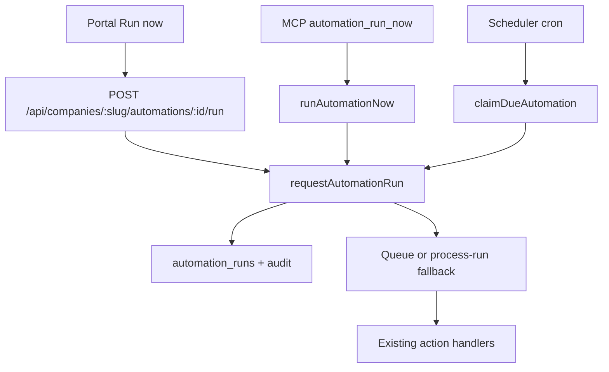

# INFRA Automation “Run now”

Universal manual execution for every supported INFRA automation. The same Automation Engine path serves the scheduler, the company portal, and ChatGPT / Claude MCP clients.

## Architecture

`requestAutomationRun` in `packages/api/src/services/automation-engine/run-request.ts` is the only place that creates a run and kicks the processor. It never writes schedule, timezone, enabled/paused status, `next_run_at`, recipients, or instructions.

### Trigger sources

| Trigger stored on the run | Started by |
|---|---|
| `schedule` | Automation scheduler |
| `portal_manual` | Portal **Run now** |
| `mcp_manual` | ChatGPT / Claude `automation_run_now` |
| `manual` | Legacy / internal helpers (still accepted) |

Paused means “do not run on schedule.” A paused automation can still be run manually. Disabled and archived automations cannot.

## Authentication and tenant resolution

- Portal and REST resolve the company from the authenticated session + URL slug. The client cannot supply another tenant id.
- MCP resolves the company from the authenticated INFRA gateway identity. Models must not pass an arbitrary tenant.
- Lookups always use `(company_id, automation_id)`. A valid id from another company returns not found.
- Portal management (`company_admin` / `director`) and MCP ChatGPT/Claude identities for that company share the same underlying permission helpers.

ChatGPT and Claude must connect to the **INFRA gateway**, never a company MCP:

`https://infra-api.daniel-dwyer123.workers.dev/api/gateway/v1/mcp`

Company MCP servers (Caddington/HT/EL) do not advertise automation-control tools.

## MCP tools

INFRA does not add `infra_list_automations` aliases. The production names are:

### `automation_list`

Read-only. Tenant comes from the authenticated connection.

Arguments:

| Field | Type | Notes |
|---|---|---|
| `status` | `active` \| `paused` \| `all` | Default `all` (archived excluded) |
| `includeArchived` | boolean | Default false |

Returns id, name, description, `enabled` / `paused`, schedule label, timezone, next run, last run status/trigger/time, recipient, and `manualRunSupported`.

Example utterances: “Show me my active automations.”

### `automation_run_now`

Write. Executes the saved automation immediately with trigger `mcp_manual`.

Arguments (id **or** unique name):

| Field | Aliases | Notes |
|---|---|---|
| `automationId` | `automation_id` | Exact id |
| `name` | `automation_name` | Case-insensitive unique name |
| `idempotencyKey` | `idempotency_key` | Same key returns the same run |

Behaviour:

- Ambiguous name → `409 AMBIGUOUS_NAME` with candidates; nothing is executed.
- Unknown → `404 NOT_FOUND`.
- Paused is allowed; schedule and enabled state are not changed.
- Response includes `runId`, `status`, `startedAt`, `scheduleChanged: false`, `scheduleUnchanged: true`, and a customer message confirming the schedule is unchanged.

Example utterances:

- “Run my Daily month-to-date sales automation now.”
- “Run it once now but do not change its normal 8:00 a.m. schedule.”
- “Run the paused document activity automation once.”

### `automation_get_run`

Read-only. Arguments: `runId` / `run_id`.

Returns current or final status, trigger, times, and a concise failure reason when failed.

Example utterance: “Show me whether that manual run completed.”

## Concurrency and idempotency

1. The same idempotency key always returns the same run (even after it completed).
2. A new deliberate request (new key, or no key) may create a new run **only if** no run is currently `queued` or `running`.
3. If a run is already active, later portal clicks, MCP retries, Cloudflare retries, or the scheduler return that active run instead of starting a second one.
4. The scheduler also skips claiming `next_run_at` while a run is active, so a manual run does not consume or rewrite the next scheduled slot.
5. After the active run completes, the next due scheduled slot or a later Run now can start a new run.

Portal double-clicks are additionally guarded in the UI (in-flight ref + disabled button) and send one `Idempotency-Key` per confirmed click.

When `AUTOMATION_RUN_QUEUE` is not bound, the engine runs the job in-request via `processAutomationRunJob`. A public `workers.dev` self-fetch is not used (Cloudflare 1042). Operators can still call `POST /api/internal/automation/process-run`.

## Run history

Every attempt writes `automation_runs` with:

- run id, company id, automation id
- trigger source (`schedule` / `portal_manual` / `mcp_manual`)
- initiating user or service label
- created / started / completed times
- queued / running / completed / failed
- result summary, safe error code/message
- idempotency key

Secrets and access tokens are not stored. Portal history labels scheduled vs portal vs ChatGPT runs and shows the run id.

## Portal behaviour

On every automation row/card and the detail drawer:

- **Run now** with accessible `aria-label` / `title` “Run now”
- Shown for active and paused automations
- Confirmation when the run sends email or other chargeable work
- Disabled while the request is in flight
- One idempotency key per confirmed click
- Toast + history show Queued / Running / Completed / Failed and the run id
- Pause / Resume remain visually distinct (ghost vs secondary)
- Last-run list refreshes after the request; schedule controls are not toggled

## Deployment and ChatGPT / Claude refresh

Automation tools are registered in `AUTOMATION_CONTROL_TOOLS` and injected by `withAutomationControlTools` into the INFRA gateway `tools/list` response after the company-MCP allowlist. They are part of the `infra-api` Worker, not a separate MCP process.

After a production Worker deploy:

1. Confirm `POST /api/gateway/v1/mcp` `tools/list` includes `automation_list`, `automation_run_now`, and `automation_get_run`.
2. **ChatGPT:** open the custom connector / GPT Actions connection → refresh tools or disconnect and reconnect to the INFRA gateway URL. ChatGPT caches the published catalogue (see ADR 025). A stale session will not see new tools until refresh.
3. **Claude:** disconnect and reconnect the custom connector, or reload MCP tools in the project settings.
4. Do not point either client at a company MCP URL (`caddington-mcp`, HT, EL). Those catalogues never include automation control.

If tools are missing after deploy, treat it as MCP discovery / client cache — not an Automation Engine failure.

## Example ChatGPT / Claude request

> Using Caddington INFRA, show me my active automations. Then run my “Daily month-to-date sales” automation now. Do not change its normal 8:00 a.m. schedule.

Expected tool sequence:

1. `automation_list` with `status: "active"`
2. `automation_run_now` with `automation_name: "Daily month-to-date sales"`
3. Optional `automation_get_run` with the returned `runId`

The assistant should return the run id / status and explicitly confirm that the 08:00 Europe/London schedule and enabled state were not changed.
