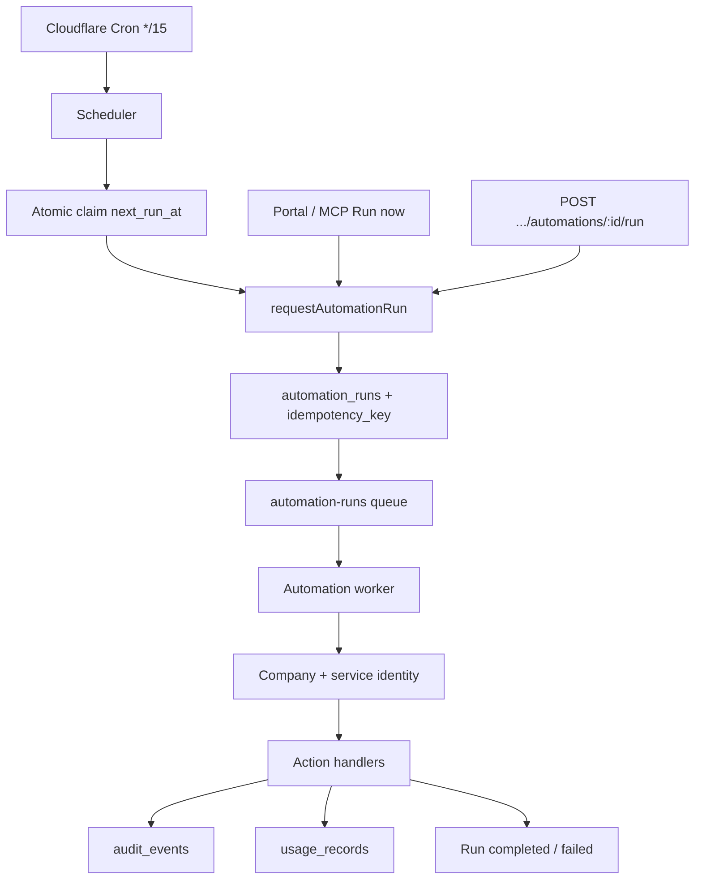

# INFRA Automation Engine V1

Multi-tenant scheduled and manual automations for company administrators.

## Architecture



## Database model

Migration: `infra/migrations/0030_automation_engine.sql`

| Table | Purpose |
|-------|---------|
| `automation_definitions` | Company-owned automation config |
| `automation_runs` | Execution instances with idempotency |
| `automation_run_steps` | Per-step results (V1: single step) |
| `automation_events` | Engine-internal event stream |

## Scheduler

- Single cron (`*/15 * * * *`) scans all due automations — not one cron per customer.
- Due query: `status = active`, `trigger_type = schedule`, `next_run_at <= now`.
- **Atomic claim:** `UPDATE ... WHERE next_run_at = expected` advances `next_run_at` before enqueue.
- **Idempotency:** unique index on `(automation_id, idempotency_key)` where key is `{automationId}|{slotUtcIso}`.
- Duplicate scheduler workers cannot create duplicate runs for the same slot.

## Queue

- Queue: `automation-runs` with DLQ `automation-runs-dlq`.
- Message shape: `{ runId, companyId, automationId }` — identifiers only, no secrets.
- Fallback: in-request `processAutomationRunJob` when the queue binding is unavailable (do not self-fetch `workers.dev`). Operator route: `POST /api/internal/automation/process-run`.

## Execution lifecycle

1. Run created (`queued`)
2. Worker marks `running`, creates step
3. Action handler executes in tenant context
4. Success → `completed`, failure → `failed` (retry via queue when retryable)
5. Audit + metering recorded
6. Definition `last_run_at` / `failure_count` updated

## Permission model

- Automations belong to exactly one company (`company_id` on all rows).
- API resolves company from authenticated slug — never trusts client-supplied company IDs.
- Management: `company_admin` / `director` (platform admin override).
- View: supervisors and above.
- On activation, a dedicated `service_identity` (`identityType: automation`) is provisioned.
- MCP tool actions use `executeGatewayRequest` with normal service permission grants.
- Automations cannot access another tenant's connectors, documents, or secrets.

## Action handlers

| Type | V1 behaviour |
|------|----------------|
| `ai_prompt` | Tenant-scoped deterministic response (LLM deferred to V2) |
| `mcp_tool` | Gateway execution with service identity permissions |
| `internal` | Allowlisted handlers only (`noop`, `health_ping`) |

### Adding a new action type

1. Add to `AUTOMATION_ACTION_TYPES` in `@infra/shared`
2. Extend migration CHECK constraint (additive migration)
3. Implement handler in `actions/`
4. Register in `actions/index.ts` + `validateAutomationConfiguration`

### Adding a future trigger type

1. Add to `AUTOMATION_TRIGGER_TYPES` (already extensible in schema)
2. Implement trigger source (webhook route, connector event consumer, etc.)
3. Call `requestAutomationRun()` with appropriate `idempotencyKey`

## Timezone behaviour

- Schedules store IANA timezone + JSON schedule `{ frequency, hour, minute, ... }`.
- `computeNextRunUtcIso()` uses `Intl` — correct through Europe/London BST/GMT transitions.
- Do not store fixed UTC hour values for local-time schedules.

## API endpoints

| Method | Path | Description |
|--------|------|-------------|
| GET | `/api/companies/:slug/automations` | List |
| GET | `/api/companies/:slug/automations/:id` | Get |
| POST | `/api/companies/:slug/automations` | Create |
| PATCH | `/api/companies/:slug/automations/:id` | Update |
| POST | `/api/companies/:slug/automations/:id/activate` | Activate |
| POST | `/api/companies/:slug/automations/:id/pause` | Pause |
| POST | `/api/companies/:slug/automations/:id/disable` | Disable |
| POST | `/api/companies/:slug/automations/:id/run` | Run now (`portal_manual`). Accepts `Idempotency-Key`. Does not change schedule or enabled state. |
| GET | `/api/companies/:slug/automations/:id/runs` | Run history |
| GET | `/api/companies/:slug/automation-runs/:runId` | Run detail |

## Portal

Company portal → **Automations** (`/portal/:slug/automations`):

- List with status, trigger, last/next run
- Create scheduled or manual AI instruction
- Run now (active and paused), pause, resume
- Recent run history drawer with trigger source and run id
- See [INFRA-AUTOMATION-RUN-NOW.md](./INFRA-AUTOMATION-RUN-NOW.md) for MCP tools, concurrency, and ChatGPT/Claude refresh.

## Audit events

- `automation.created`, `automation.updated`, `automation.activated`, `automation.paused`, `automation.disabled`
- `automation.manual_run_requested`
- `automation.run_started`, `automation.run_completed`, `automation.run_failed`

## Metering

- Resource type `automation`, action `automation.{actionType}`
- Request ID `automation_run_{runId}` prevents duplicate charges
- MCP tool executions skip duplicate metering when gateway already recorded usage

## Retry / failure

- `maximum_retries` on definition (default 3)
- Retryable errors re-thrown to Cloudflare Queue for backoff
- Repeated failures mark automation `error` when retries exhausted

## Acceptance

```bash
node infra/packages/api/scripts/run-automation-acceptance.mjs
```

Tests co_caddington manual AI prompt + scheduler idempotency (non-destructive).

## Known V1 limitations

- AI prompt action is deterministic (no external LLM)
- Single-step runs only (no multi-step workflows)
- Schedule frequencies: hourly, daily, weekdays, weekly, monthly
- Webhook / connector / email triggers defined in schema but not implemented

## Recommended V2

- External LLM integration with token metering
- Multi-step workflows and approvals
- Outlook / Xero / webhook triggers
- Rich portal editing for MCP tool actions
