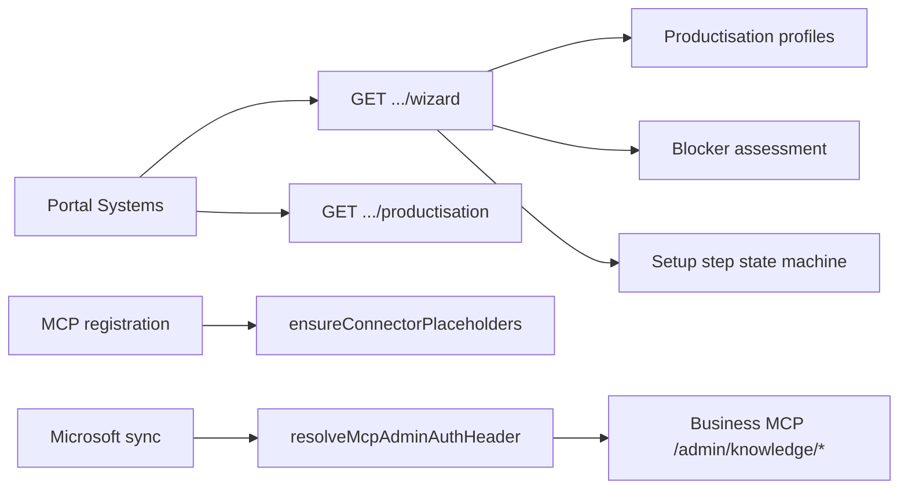

# CONNECTOR PRODUCTISATION REPORT — Backlog Sprint 1

## Executive summary

Implemented a reusable **Connector Productisation Framework** so Xero, Microsoft 365, and Google Drive share a common self-service onboarding model: profiles, blocker assessment, setup wizard API, portal wizard UI, generic MCP admin bridge, and connector placeholder seeding.

**SELF-SERVICE CONNECTORS: PARTIAL**

| Connector | Self-service | Classification |
|-----------|--------------|----------------|
| Xero | Portal OAuth connect (platform secrets required) | **PASS** |
| Microsoft 365 | Source management UI exists; tenant onboarding blocked | **FAIL** (platform single-tenant) |
| Google Drive | MCP-managed; INFRA shows health only | **PARTIAL** |

CMD16B / Outlook RBAC was not modified.

## Architecture

## What was built

### Shared contracts (`@infra/shared`)
- `connectors/onboarding.ts` — step IDs, wizard state, productisation assessment types

### API services
- `connector-productisation/profiles.ts` — Xero, M365, Google Drive profiles
- `connector-productisation/blockers.ts` — per-company blocker assessment
- `connector-productisation/wizard.ts` — setup wizard state machine
- `connector-productisation/seed-placeholders.ts` — draft connector instances on MCP register
- `mcp-admin-bridge.ts` — per-MCP admin token resolution (replaces hard-coded CADDINGTON-only path)

### API endpoints
- `GET /api/companies/:slug/connectors/productisation`
- `GET /api/companies/:slug/connectors/:definitionId/wizard`

### Portal
- `ConnectorSetupWizard.tsx` — step-by-step setup in Systems modal
- Google Drive: credential form hidden; MCP-managed notice shown

### Migration
- `0031_connector_productisation.sql` — `mcp_environments.admin_secret_ref`, `connector_instances.setup_progress_json`

## Blockers preventing HeatTech / Elvex / new customers

| Blocker | Affects | Remediation sprint |
|---------|---------|-------------------|
| Microsoft platform single-tenant credentials | M365 for non-Caddington tenants | Backlog 2 |
| Company MCP must be registered manually | All AI/knowledge execution | Operator MCP registration (pattern exists) |
| HT/EL MCP lack Xero tool wiring in-repo | Xero AI tools | Package `@infra/xero-core` bootstrap |
| Google Drive on Company MCP only | Drive knowledge | MCP template (ADR 024) |
| Worker secrets for platform OAuth apps | Xero/M365 connect | Expected SaaS ops — not customer-facing |

## What HeatTech / Elvex can do today (after this sprint)

- **Xero:** Connect via portal OAuth if platform Xero app + wrapping key configured
- **Microsoft 365:** Blocked until Backlog 2 multi-tenant OAuth
- **Google Drive:** See MCP-managed status; requires Business MCP Drive module

## Tests

- `connector-productisation.test.ts` — profiles, blockers, wizard, admin bridge
- Existing API suite regression required on commit

## Recommended next sprints

1. **Backlog 2** — Microsoft 365 self-service multi-tenant OAuth
2. **Backlog 3** — Xero self-service hardening + second-tenant proof
3. MCP Xero bootstrap template for HT/EL Workers

## BACKLOG STATUS

| Item | Status |
|------|--------|
| Automation Engine V1 | **DONE** (PR #328, acceptance PASS) |
| Backlog 1 — Connector Productisation | **DONE** (this sprint) |
| Backlog 2 — Microsoft 365 Self-Service | NOT STARTED |
| Backlog 3 — Xero Self-Service | NOT STARTED |
| Backlog 4–12 | NOT STARTED |
